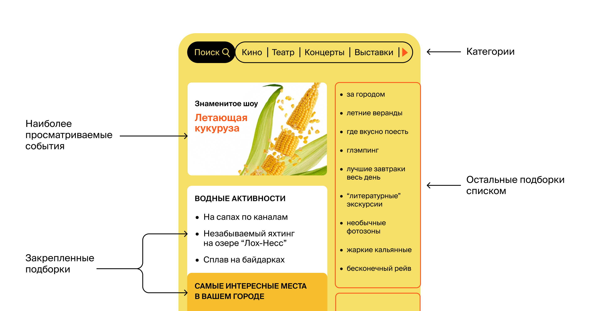
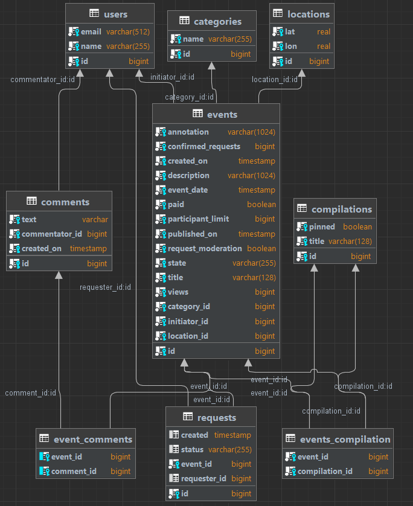
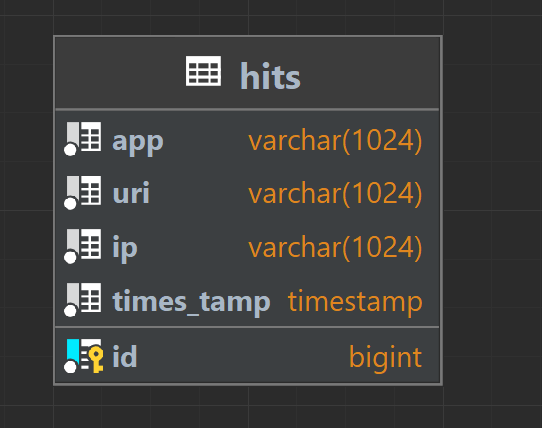
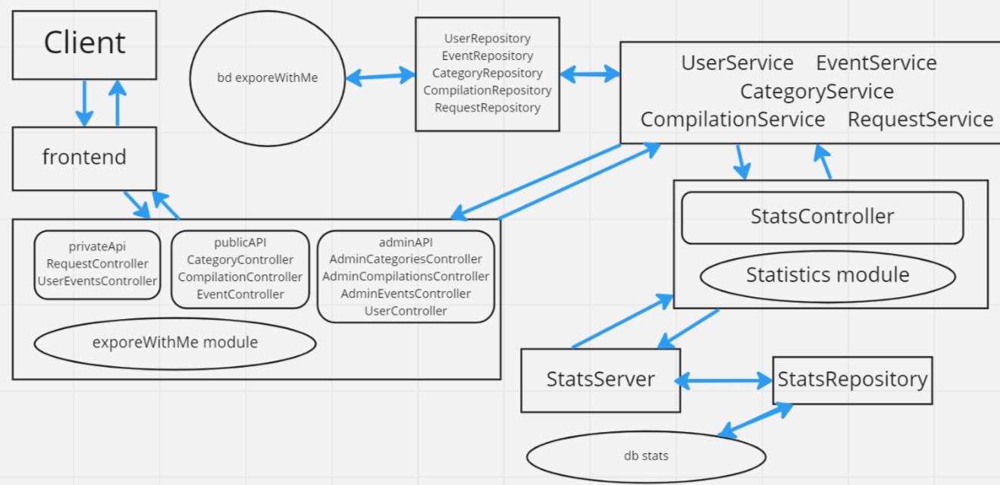

# explore-with-me
Template repository for ExploreWithMe project.
### Описание
Сервис-афиша, где можно предложить какое-либо событие от выставки до похода в кино и набрать 
компанию для участия в нём.

# Дипломный проект 
# Идея
Свободное время — ценный ресурс. Ежедневно мы планируем, как его 
потратить — куда и с кем сходить. Сложнее всего в таком 
планировании поиск информации и переговоры. Какие намечаются 
мероприятия, свободны ли в этот момент друзья, как всех 
пригласить и где собраться. Приложение, которое я создал 
, — афиша, где можно предложить какое-либо событие от 
выставки до похода в кино и набрать компанию для участия в нём.
# Два сервиса
Созданы два сервиса.
Основной сервис — содержит всё необходимое для работы продукта.
Сервис статистики — хранит количество просмотров и позволяет делать различные 
выборки для анализа работы приложения.
Расскажу подробнее, что входит каждого сервиса.
## Основной сервис
API основного сервиса разделён на три части. Первая — публичная, доступна без 
регистрации любому пользователю сети. Вторая — закрытая, доступна только 
авторизованным пользователям. Третья — административная, для администраторов 
сервиса.
### Публичный API
Публичный API предоставляет возможности поиска и фильтрации событий.
1. Сортировка списка событий организована либо по количеству 
просмотров, которое должно запрашиваться в сервисе статистики, либо по датам событий.
2. При просмотре списка событий возвращается только краткая информация о мероприятиях.
3. Просмотр подробной информации о конкретном событии настроено отдельно 
(через отдельный эндпоинт).
4. Каждое событие относиться к какой-то из закреплённых в приложении категорий.
5. Настроена возможность получения всех имеющихся категорий и подборок событий 
(такие подборки будут составлять администраторы ресурса).
6. Каждый публичный запрос для получения списка событий или полной информации 
о мероприятии фиксируется сервисом статистики.
### API для авторизованных пользователей
Закрытая часть API реализует возможности зарегистрированных пользователей продукта.
1. Авторизованные пользователи имеют возможность добавлять в приложение новые 
мероприятия, редактировать их и просматривать после добавления.
2. Настроена подача заявок на участие в интересующих мероприятиях.
3. Создатель мероприятия имеет возможность подтверждать заявки, которые отправили 
другие пользователи сервиса.
### API для администратора
Административная часть API предоставляет возможности настройки и поддержки работы сервиса.
1. Настроены добавление, изменение и удаление категорий для событий.
2. Существует возможность добавлять, удалять и закреплять на главной странице подборки мероприятий.
3. Налажена модерация событий, размещённых пользователями, — публикация или отклонение.
4. Настроено управление пользователями — добавление, просмотр и удаление.
## Сервис статистики
Второй сервис, статистики, собирает информацию. Во-первых, о количестве 
обращений пользователей к спискам событий и, во-вторых, о количестве запросов 
к подробной информации о событии. На основе этой информации формируется 
статистика о работе приложения.
### Функционал сервиса статистики содержит:
1. Запись информации о том, что был обработан запрос к эндпоинту API;
2. Предоставление статистики за выбранные даты по выбранному эндпоинту.
# Модель данных
Жизненный цикл события включает несколько этапов.
1. Создание.
2. Ожидание публикации. В статус ожидания публикации событие переходит сразу после создания.
3. Публикация. В это состояние событие переводит администратор.
4. Отмена публикации. В это состояние событие переходит в двух случаях. 
Первый — если администратор решил, что его нельзя публиковать. 
Второй — когда инициатор события решил отменить его на этапе ожидания публикации.

### Используемые технологии
Java, Spring Boot, Lombok, JPA, Hibernate, PostgreSQL, Maven, Docker, Javadoc

### Составные части проекта

#### 1. Основной микросервис
Запускается на порту 8080. 
Имеет отдельную Базу Данных. 
[Swagger спецификация основного сервиса](ewm-main-service-spec.json) 
Состоит из 2 частей:
1. **Приватная часть:** для зарегистрированных пользователей и администраторов сервиса. Позволяет создавать,
   обновлять, удалять, модерировать события. Добавлять, удалять пользователей. Управлять запросами на участие в событиях.
   Создавать, менять, удалять категории и подборки событий.
2. **Публичная часть:** для всех остальных пользователей, позволяет искать опубликованные события. Просматривать детальную
   информацию о событии по его id.

#### Диаграмма БД основного сервиса

#### 2. Микросервис статистики
Запускается на порту 9090. 
Имеет отдельную Базу Данных. 
[Swagger спецификация сервиса статистики](ewm-stats-service-spec.json) 
Позволяет сохранять и получать статистические данные о запросах на публичную часть основного сервиса.  
Сохраняет и предоставляет информацию о:
- адресах на которые поступали запросы
- ip адресах пользователей делающих запросы
- общем количестве просмотров определенных событий
- количестве просмотров с уникальных ip
- количестве просмотров за определенный промежуток времени

#### Диаграмма БД сервиса статистики

### Условная схема взаимодействия компонентов проекта

### Порядок запуска проекта
- **В ручном режиме:**
    - Запустить БД сервиса статистики
    - Запустить сервис статистики
    - Запустить БД Основного сервиса
    - Запустить основной сервис
- **В автоматическом режиме:**
    - Для всех частей сервиса предусмотрен отдельный Docker-контейнер
    - Сборка всего проекта **maven -clean -install**
    - Общий запуск из корневой папки командой **docker compose up**